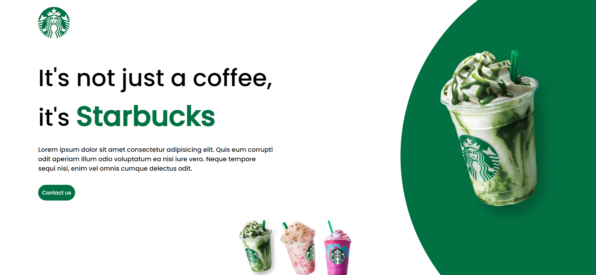

# Starbucks Webpage Project



This project is a simple webpage for a fictional Starbucks-like brand, designed specifically for computer screens. Below, we highlight the key functionalities implemented using JavaScript.

## JavaScript Features

### Cup Color Selection

- Implemented dynamic cup color change functionality using JavaScript.
- Added event listeners to three small cup images in the menu.
- When a user clicks on a cup, it updates the main cup image and changes the background color.

```javascript
let circulo = document.querySelector(".circulo");
let imgCopo = document.querySelector(".starbucks");
let verde = document.querySelector(".verde");
let amarelo = document.querySelector(".amarelo");
let rosa = document.querySelector(".rosa");

verde.addEventListener("click", () => {
    imgCopo.src = "./images/img1.png";
    circulo.style.background = "#017143";
});

amarelo.addEventListener("click", () => {
    imgCopo.src = "./images/img2.png";
    circulo.style.background = "#eb7495";
});

rosa.addEventListener("click", () => {
    imgCopo.src = "./images/img3.png";
    circulo.style.background = "#d752b1";
});

```
## Getting Started

### Prerequisites

- Web browser (Chrome, Firefox, Safari, etc.)

### Installation

1. Clone the repository:

   ```bash
   git clone https://github.com/jokasta29/starbucks_website_js.git
   
   1. Open index.html in your preferred web browser.


## Contributing
Contributions are welcome! If you find any issues or have suggestions for improvements, please open an issue or create a pull request.

## License
This project is licensed under the MIT License.
